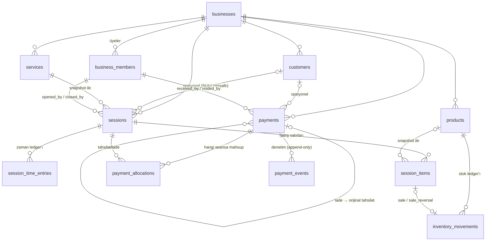

# Veritabanı Tasarımı (v2 — Production Modeli)

> Migration'lar: `supabase/migrations/20260717130000..130200`
> Test paketi: `supabase/tests/rls_test.sql` (20 senaryo)
> Bu doküman `architecture.md`'nin veri katmanı bölümünün yerini alır; oradaki
> `numeric(12,2)` para modeli ve `owner/manager/employee` rolleri **güncel değildir**.

## 1. Tasarım Kararları ve Varsayımlar

| Karar | Seçim | Neden |
|-------|-------|-------|
| Para | En küçük birim (kuruş) `bigint` + ISO 4217 `currency_code` | Float yuvarlama hatası imkansız; toplama/çarpma tam sayı aritmetiği |
| Silme | Fiziksel silme yok: `is_active` + `archived_at`; FK'ler `on delete restrict` | Finansal geçmiş korunur; DELETE grant'i çoğu tabloda hiç yok |
| Zaman takibi | `session_time_entries` ledger'ı (aralık kayıtları) | Denetlenebilir; pause/resume geçmişi kaybolmaz; süre `sum(active aralıklar)` |
| Yuvarlama | `charged_minutes = max(ceil(aktif_dk / interval) * interval, minimum_charge)` | Faturalamada standart yukarı yuvarlama (varsayım) |
| Stok | `inventory_movements` ledger (kaynak) + `products.stock_quantity` cache | Liste/stok sorguları tek kolon okur; cache'e yalnızca trigger yazar, her ledger insert'i aynı transaction'da cache'i günceller; `check (stock >= 0)` eşzamanlılıkta bile negatif stoğu engeller |
| Aynı ürün tekrar | `UNIQUE(session_id, product_id)` YOK — ayrı satırlar | Farklı fiyat/indirim senaryoları desteklenir (spec varsayılanı) |
| Roller | `owner / admin / staff` | Spec gereği; eski dokümandaki manager/employee adlandırması kaldırıldı |
| Tenant bütünlüğü | Composite FK: `(customer_id, business_id) → customers(id, business_id)` vb. | "Seansın müşterisi başka işletmeden" durumu DB seviyesinde imkansız; trigger'a gerek kalmaz, index destekli |
| Seans yaşam döngüsü | Yalnızca RPC (tablolara insert/update grant'i yok; `sessions`'ta yalnız `notes, customer_id` kolonları güncellenebilir) | Status makinesi ve finansal alanlar client'tan bozulamazsın |
| Movement kaydı | Yalnızca `track_stock = true` ürünlerde yazılır | Ledger stok yönetilen ürünleri izler (varsayım) |
| `draft` status | Enum'da var, şu an RPC üretmiyor | İleride "hazırlık" akışı için rezerve |

## 2. ER Diyagramı



### 2.1 Ödeme tabloları *(eklendi: 2026-07-19)*

**Satış ≠ tahsilat.** `sessions.grand_total_minor` "müşteri ne kadar
borçlandı"yı, `payments` + `payment_allocations` "ne kadarı fiilen tahsil
edildi"yi tutar. **Tamamlanmış seans ödenmiş demek değildir.**

| Tablo | Rolü | Kritik invariant |
|---|---|---|
| `payments` | Tahsilat ve iade kayıtları | `amount_minor > 0` **her zaman** (yönü `payment_kind` taşır); `unique(business_id, idempotency_key)`; iade orijinaline bağlı olmak zorunda; iptalliyse gerekçe+kim+ne zaman üçü de dolu |
| `payment_allocations` | Ödemenin hangi seansa mahsup edildiği | Ayrı tablo olması, ileride tek ödemenin çok seansa bölünmesini şema değişikliği olmadan mümkün kılar |
| `payment_events` | Append-only denetim izi | UPDATE/DELETE yetkisi **hiçbir role** verilmez (`inventory_movements` deseni) |

Seansın ödeme durumu (`unpaid` / `partially_paid` / `paid`) **saklanmaz,
türetilir**: `net = tahsilat − iade`, iptal edilmiş (`voided`) ödemeler
hiçbir toplama girmez. `remaining_minor` asla negatif olmaz.
Gerekçe: ADR 0002 §2.

Tüm çocuk referanslar composite FK `(x_id, business_id)` ile kurulur —
başka işletmenin müşterisine/personeline/ödemesine bağlanmak **veritabanı
seviyesinde imkansızdır**.

Ayrıntılı kontrat: `docs/contracts/payment-contract.md`
Karar gerekçeleri: `docs/adr/0002-payment-and-collection-model.md`

## 3. RPC Kataloğu

| Fonksiyon | Ne yapar | Kritik guard |
|-----------|----------|--------------|
| ~~`create_business_with_owner(name, currency, tz)`~~ **KALDIRILDI** *(20260718090100)* | — | Hizmetsiz işletme üretebiliyordu: kullanıcı onboarding'i atlayıp bu RPC'yi çağırınca `start_session` imkansız hale gelen kilitli bir hesapla kalıyordu. Yerine `complete_onboarding` |
| `add_business_member` / `update_business_member_role` / `set_business_member_active` / `remove_business_member` / `transfer_business_ownership` *(eklendi: 2026-07-18)* | Üyelik mutasyonlarının tek yolu | `business_members`'a doğrudan insert/update/delete grant'i YOK. Her çağrıda çağıranın rolü sunucuda doğrulanır; admin owner satırına dokunamaz ve kimseyi owner yapamaz; **son aktif owner silinemez/pasifleştirilemez/rolü düşürülemez**. Eşzamanlılık `businesses` satırı `FOR UPDATE` ile serileştirilir |
| `complete_onboarding(...)` *(eklendi: 2026-07-17)* | İşletme + owner + zorunlu ilk hizmet + opsiyonel ürün (tek tx) | Hizmetsiz işletme imkansız; herhangi bir adım başarısızsa hepsi rollback. Uygulama onboarding'de bunu kullanır |
| `create_product_with_stock(...)` *(eklendi: 2026-07-17)* | Ürün + varsa ilk stok (tek tx) | İlk stok cache'e değil `inventory_movements`'a `initial` olarak yazılır; cache'i trigger günceller. owner/admin yetkisi. Ürün CRUD create'i bunu kullanır — stok cache'i asla doğrudan yazılmaz |
| `report_revenue_summary` / `report_top_services` / `report_top_products` / `report_top_customers` / `dashboard_metrics` *(eklendi: 2026-07-17)* | Raporlar SUNUCU TARAFINDA aggregate edilir | İşletme saat dilimine göre dönemler (DST dahil), yalnız `completed` seanslar gelire girer, tüm tutarlar minor bigint, `is_business_member` kontrolü. **Uygulama raporları/dashboard'u bu RPC'lerden okur — client'ta toplama yapmaz** (kesme/eksik gelir yok) |
| `start_session(business, service, customer?, notes?)` | Snapshot'lı seans + ilk active aralık | Üyelik, hizmet/müşteri aynı işletmede ve aktif |
| `pause_session(session)` | Açık aralığı kapat, paused aralık aç | `status='active'` şartı → çifte pause imkansız |
| `resume_session(session)` | Paused kapat, active aç | `status='paused'` şartı |
| `add_product_to_session(session, product, qty, discount?, tax?)` | Snapshot'lı satır + sale movement | Ürün `FOR UPDATE` kilidi, stok kontrolü, currency eşleşmesi |
| `complete_session(session, discount?, tax?)` | Süre→ücret hesabı, toplamlar, `completed` | `FOR UPDATE` + status şartı → çifte tamamlama imkansız |
| `cancel_session(session)` | Stok iadesi + `cancelled` | Tamamlanmışı yalnız owner/admin iptal eder; iade satır başına 1 kez (partial unique + on conflict) |
| `record_session_payment(session, method, amount, idem_key, ref?, note?)` *(eklendi: 2026-07-19)* | Tahsilat + tahsis + denetim olayı (tek tx) | Seans `FOR UPDATE` kilidi; kalan bakiye **kilidin altında** yeniden hesaplanır → eşzamanlı cihazlar bakiyeyi aşamaz. Yalnız `completed` seans ödenebilir. Aynı idempotency key ikinci ödeme üretmez (`replayed: true` döner). owner/admin/**staff** |
| `get_session_payment_summary(session)` *(eklendi: 2026-07-19)* | Ödeme özeti + güvenli geçmiş | Aktif üyelik şartı; başka tenant'ın seansı varlığını sızdırmadan `session_not_found` döner. E-posta/user_id dönmez |
| `void_payment(payment, reason)` *(eklendi: 2026-07-19)* | Tahsilatı geçersiz kılar | **owner/admin**; gerekçe zorunlu; kayıt **silinmez** (`status='voided'`), net toplamdan çıkar, denetim olayı yazılır; ikinci iptal `payment_already_voided`. İade kayıtları iptal edilemez |
| `refund_payment(payment, amount, idem_key, reason)` *(eklendi: 2026-07-19)* | Kısmi/tam iade | **owner/admin**; orijinal `FOR UPDATE`; iade edilebilir tutar aşılamaz; orijinal kayıt **değiştirilmez/silinmez**, iade **yeni** kayıttır; ayrı idempotency key zorunlu |

## 4. Örnek Kullanım

```sql
-- Onboarding'in tek kapısı (işletme + owner + ZORUNLU ilk hizmet, tek tx):
select complete_onboarding(
  'Berber Ali', 'TRY', 'Europe/Istanbul',
  'Koltuk', 250, 15, 10                                                     -- → business_id
);
select start_session(:business_id, :service_id);                            -- misafir seans
select start_session(:business_id, :service_id, :customer_id, 'VIP');
select pause_session(:session_id);
select resume_session(:session_id);
select add_product_to_session(:session_id, :product_id, 2, 500);            -- 2 adet, 500 minor indirim
select complete_session(:session_id, 0, 2000);                              -- 2000 minor vergi
select cancel_session(:session_id);

-- Seansın gerçek aktif süresi (saniye):
select coalesce(sum(extract(epoch from coalesce(ended_at, now()) - started_at)), 0)
from session_time_entries
where session_id = :session_id and entry_type = 'active';

-- Elle stok girişi (yalnız owner/admin). Stok DAİMA ledger üzerinden girilir;
-- products.stock_quantity'ye doğrudan UPDATE yetkisi yoktur (20260718090000).
insert into inventory_movements (business_id, product_id, movement_type, quantity_delta, note)
values (:business_id, :product_id, 'restock', 24, 'yeni koli');

-- Üyelik yönetimi (doğrudan tablo yazma yetkisi yok):
select add_business_member(:business_id, :user_id, 'staff');
select update_business_member_role(:member_id, 'admin');
select set_business_member_active(:member_id, false);
select transfer_business_ownership(:business_id, :to_member_id);
```

## 5. Kritik Edge Case'ler

1. **Eşzamanlı satış:** İki cihaz aynı anda son stoğu satarsa: `FOR UPDATE` kilidi sıralar, geç gelen `insufficient_stock` alır. Kilit atlansa bile `check (stock_quantity >= 0)` ikinci düşümü DB'de patlatır → rollback.
2. **Çifte tamamlama/iptal:** `FOR UPDATE` + status kontrolü; iade ayrıca `uq_inventory_item_movement` partial unique ile korunur.
3. **Uygulama çökmesi:** Süre `started_at`/aralıklardan türetilir (server saati); client timer yalnızca görsel.
4. **Fiyat/ad/para birimi değişimi:** Geçmiş seans snapshot kolonlarından okur — test 14 bunu doğrular.
5. **Admin yetki yükseltmesi:** Admin, owner satırı oluşturamaz/değiştiremez/silemez (policy'de `role <> 'owner'` guard'ı).
6. **Currency karışması:** `add_product_to_session` ürün para birimini seans snapshot'ıyla karşılaştırır → `currency_mismatch`.
7. **Aşırı ödeme (eşzamanlı):** İki cihaz aynı anda ödeme girerse `record_session_payment` seansı `FOR UPDATE` ile kilitler; ikinci istek bekler, uyanınca kalan bakiyeyi **yeniden okur** ve aşım varsa reddeder. `payment_concurrency_test.sh` bunu iki gerçek bağlantıyla doğrular.
8. **Çift ödeme (ağ tekrarı):** `unique(business_id, idempotency_key)`. Tekrar isteği yeni kayıt açmaz, mevcut sonucu `replayed: true` ile döner; tam eşzamanlı çakışmada `unique_violation` yakalanır ve yine tek ödeme kalır.
9. **İade sonrası durum:** 450 ödendi → `paid`; 100 iade → net 350 → **`partially_paid`**, kalan 100. Durum saklanmadığı (türetildiği) için bu geçiş kendiliğinden doğrudur; güncellenmeyi unutan bir kolon yoktur.
10. **Müşteri partial unique önerisi (uygulanmadı):** Aynı işletmede e-posta tekilliği istenirse: `create unique index on customers (business_id, lower(email)) where email is not null;` — telefon paylaşan aile müşterileri gibi gerçek hayat durumları yüzünden şimdilik zorlanmadı.

## 6. Rollback Notları

- Supabase migration'ları ileri yönlüdür; geri almak için **ters migration yazılır** (down script otomatik değildir).
- Bu üç migration henüz hiçbir ortama deploy edilmediyse en güvenli yol: dosyayı düzeltip `supabase db reset` (yalnızca lokalde!).
- Production'a çıktıktan sonra: enum'a değer eklemek kolay (`alter type ... add value`), çıkarmak pratikte imkansız — enum değişikliklerini önden iyi düşün.
- `drop table` sırası FK zinciriyle terstir: inventory_movements → session_items → session_time_entries → sessions → products/services/customers → business_members → businesses.
- `supabase db reset` production'da ASLA çalıştırılmaz; lokal geliştirme komutudur.

## 7. Test Paketi

`supabase/tests/rls_test.sql` — **70 senaryo**: tenant izolasyonu, rol matrisi, RPC durum makinesi, stok ledger/cache tutarlılığı, snapshot bağımsızlığı, constraint'ler ve 2026-07-18 güvenlik sıkılaştırmasının pozitif/negatif testleri (29-51: doğrudan `stock_quantity` yazma reddi, kaldırılan onboarding RPC'si, son owner invariantı, admin yetki yükseltme koruması, tenant sınırı, atomik sahiplik devri). Çalıştırma komutu dosyanın başında.

**52-70 — ödeme ve tahsilat** *(eklendi: 2026-07-19)*: tamamlanan seansın ödenmemiş başlaması, staff'ın tahsil edip iptal/iade edememesi, owner/admin'in iptal ve iade edebilmesi, aşırı ödeme reddi, bölünmüş ödemenin `paid`'e ulaşması, kısmi ödemenin `partially_paid` dönmesi, idempotency ile tek ödeme, iptal edilen ödemenin net toplamdan çıkması ve **silinmemesi**, iade edilebilir tutarın aşılamaması, denetim olaylarının yazılması, aktif/iptal seansın ödenememesi, çapraz tenant okuma/mutasyon/özet reddi, doğrudan INSERT/UPDATE/DELETE reddi. Bu blok kendi işletmesini (B3) kurar; yukarıdaki testlerin son durumuna bağımlı değildir.

`supabase/tests/payment_concurrency_test.sh` — **gerçek iki bağlantılı eşzamanlılık testi** *(eklendi: 2026-07-19)*. Tek transaction'lık psql paketi iki cihazı simüle edemediği için ayrı bir harness yazıldı: A bağlantısı ödemeyi açık transaction'da tutar, B aynı anda dener ve `FOR UPDATE` kilidinde **bloke olur**; A commit edince B uyanır, kalan bakiyeyi **yeniden okur** ve `payment_exceeds_balance` ile reddedilir. Sonuç: tek ödeme, toplam aşılmaz. Test verisi çalışma sonunda tamamen silinir.
